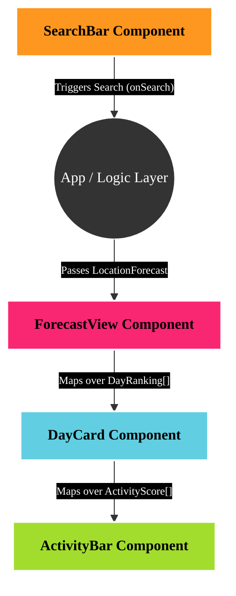
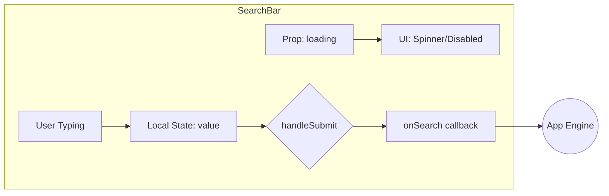
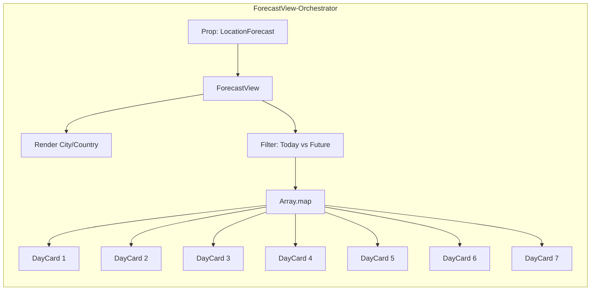
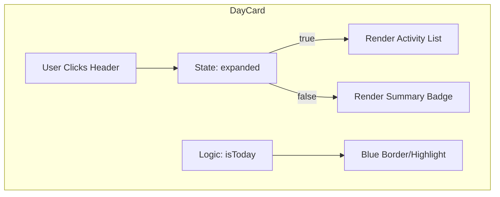
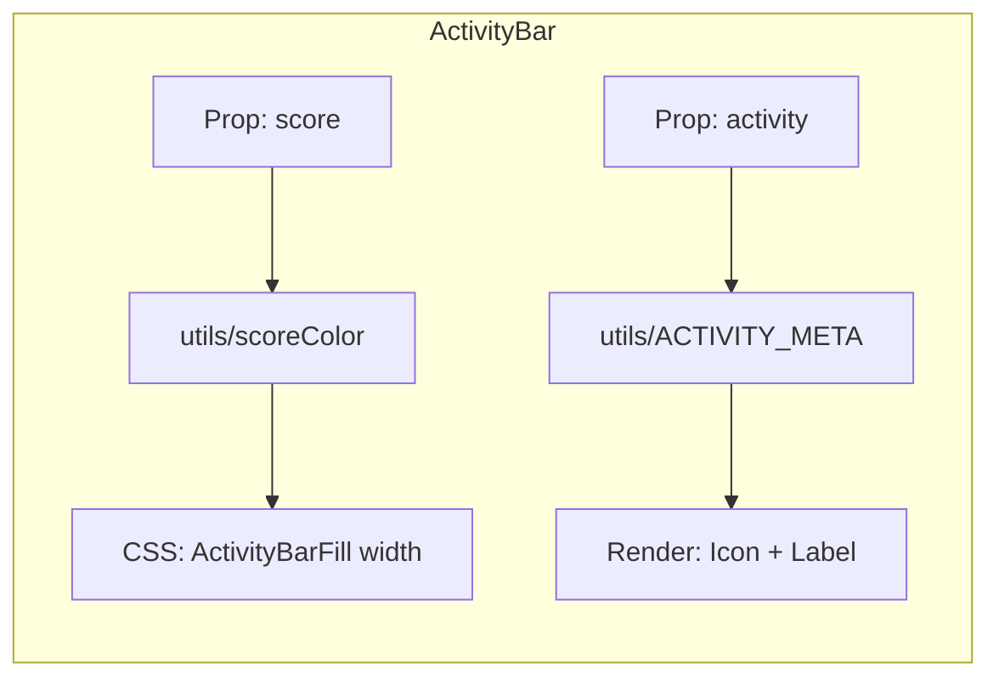

```mermaid
%%{init: {'themeVariables': { 'edgeLabelBackground':'#000000', 'tertiaryColor': '#000000' }}}%%
graph TD
    %% Component Nodes
    Search[SearchBar Component]
    View[ForecastView Component]
    Card[DayCard Component]
    Bar[ActivityBar Component]

    %% Data Flow and Relationships
    Search -- "Triggers Search (onSearch)" --> Parent((App / Logic Layer))
    Parent -- "Passes LocationForecast" --> View
    View -- "Maps over DayRanking[]" --> Card
    Card -- "Maps over ActivityScore[]" --> Bar

    %% Styling Nodes
    style Search fill:#FD971F,stroke:#fff,stroke-width:2px,color:#000,font-weight:600,font-family:Poppins
    style View fill:#F92672,stroke:#fff,stroke-width:2px,color:#000,font-weight:600, font-family:Poppins
    style Card fill:#62CEE1,stroke:#fff,stroke-width:2px,color:#000,font-weight:600,font-family:Poppins
    style Bar fill:#A2DD2E,stroke:#fff,stroke-width:2px,color:#000,font-weight:600,font-family:Poppins
    style Parent fill:#333,stroke:#fff,stroke-width:1px,color:#fff,font-family:Poppins

    %% Styling Edge Labels
    linkStyle 0,1,2,3 color:#fff,font-size:12px,font-family:Poppins
```

```mermaid
 graph LR
    subgraph SearchBar
    Input[User Typing] --> State[Local State: value]
    State --> Submit{handleSubmit}
    Loading[Prop: loading] --> Spinner[UI: Spinner/Disabled]
    Submit --> Callback[onSearch callback]
    end
    Callback --> Parent((App Engine))

```

```mermaid
 graph LR
    subgraph ForecastView-Orchestrator
    Data[Prop: LocationForecast] --> View[ForecastView]
    View --> Header[Render City/Country]
    View --> Logic[Filter: Today vs Future]
    Logic --> Map[Array.map]
    Map --> Child[DayCard 1]
    Map --> Child2[DayCard 2]
    Map --> Child3[DayCard 3]
    Map --> Child4[DayCard 4]
    Map --> Child5[DayCard 5]
    Map --> Child6[DayCard 6]
    Map --> Child7[DayCard 7]
    end
```

```mermaid
 graph TD
    subgraph DayCard
    Click[User Clicks Header] --> Toggle[State: expanded]
    Toggle -- true --> Show[Render Activity List]
    Toggle -- false --> Hide[Render Summary Badge]
    Style[Logic: isToday] --> UI[Blue Border/Highlight]
    end
```

```mermaid
 graph LR
    subgraph ActivityBar
    Score[Prop: score] --> Math[utils/scoreColor]
    Math --> Fill[CSS: ActivityBarFill width]
    Type[Prop: activity] --> Meta[utils/ACTIVITY_META]
    Meta --> Icon[Render: Icon + Label]
    end
 
```